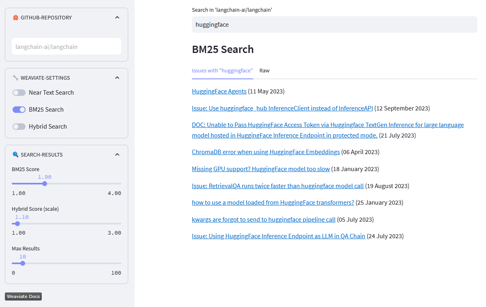

[](https://github-semantic-search.streamlit.app/)
[](https://www.python.org/)
[](https://www.codefactor.io/repository/github/dcarpintero/github-semantic-search)
[](https://github.com/dcarpintero/st-newsapi-connector/blob/main/LICENSE)

# 🦜 Semantic Search on Langchain Github Issues with Weaviate 🔍

<p align="center">
  
</p>

##  🔍 What's Semantic Search?

> *Semantic search refers to search algorithms that consider the intent and contextual meaning of search phrases when generating results, rather than solely focusing on keyword matching. The goal is to provide more accurate and relevant results by understanding the semantics, or meaning, behind the query.*

## 🚀 Quickstart

1. Clone the repository:
```
git@github.com:dcarpintero/github-semantic-search.git
```

2. Create and Activate a Virtual Environment:

```
Windows:

py -m venv .venv
.venv\scripts\activate

macOS/Linux

python3 -m venv .venv
source .venv/bin/activate
```

3. Install dependencies:

```
pip install -r requirements.txt
```

4. Ingest Data
```
python ./data-pipeline/ingest.py
```

5. Index Data
```
python ./data-pipeline/index.py
```

6. Launch Web Application

```
streamlit run ./app.py
```

## 👩‍💻 Streamlit Web App

Demo Web App deployed to [Streamlit Cloud](https://streamlit.io/cloud) and available at https://github-semantic-search.streamlit.app/ 

## 📚 References

- [Langchain Document Loaders - Github](https://js.langchain.com/docs/modules/data_connection/document_loaders/integrations/web_loaders/github)
- [Weaviate Vector Search](https://weaviate.io/developers/weaviate/search/similarity)
- [Weaviate BM25 Search](https://weaviate.io/developers/weaviate/search/bm25)
- [Weaviate Hybrid Search](https://weaviate.io/developers/weaviate/search/hybrid)
- [Weaviate Schema Configuration](https://weaviate.io/developers/weaviate/configuration/schema-configuration)
- [Weaviate - How to efficiently add data objects and cross-references to Weaviate](https://weaviate.io/developers/weaviate/manage-data/import)
- [Get Started with Streamlit Cloud](https://docs.streamlit.io/streamlit-community-cloud/get-started)